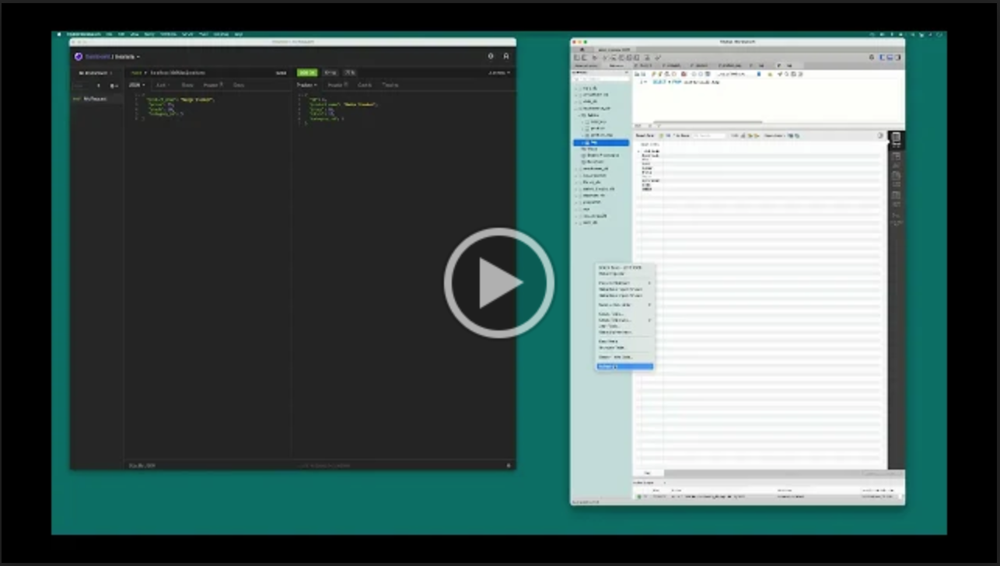

# E-Commerce Back End

## Description
A back end e-commerce application that allows the user to find, add, update and delete products, categories, and tags. The app connects to a MySQL database using the MySQL2 and Sequelize packages. It also syncs Sequelize models to a MySQL database on the server start.

## Installation

To install necessary dependencies, run the following command:

```md
npm i
```

## Usage

Use the schema.sql file in the db folder to create your database. Use environment variables to store sensitive data including your MySQL username, password, and database name. Open the integrated terminal and run the following command to seed the database. 
```md
npm run seed
```
You are now ready to start the application by running the following command.
```md
npm start
```
Then open Insomnia to perform GET, POST, PUT, and DELETE operations. Below is a walkthrough video that demonstrates the functionality of the application.

<a href="https://drive.google.com/file/d/1jZFnYR344q4SgUN3K1Jc-RnTcDSl88I5/view"></a>